# CLAUDE.md

> 最后更新：2026-05-19 | 请用中文回复，所有测试模块都放在 `test/` 中

## 项目概述

**Sap_Operation_HDL** — 基于 Python + PyQt5 的 SAP 自动化工具，提供 SAP 订单自动创建、数据处理、PDF 发票重命名、营收工时分配等功能，具有多选项卡 GUI 界面。

## 架构总览

```mermaid
graph TD
    subgraph GUI层
        A[Sap_Operate_HDL.py<br/>主入口 MyMainWindow] --> B[Sap_Operate_Ui.py<br/>Qt Designer 生成 UI]
        A --> C[Data_Table.py<br/>表格窗口]
        C --> D[Table_Ui.py<br/>表格 UI 代码]
        A --> TM[theme_manager_theme.py<br/>主题管理]
    end

    subgraph Mixin业务层
        A --> M1[main_window_ui_mixin.py<br/>UI 初始化与主题]
        A --> M2[config_mixin.py<br/>配置加载/GUI 数据]
        A --> M3[sap_order_mixin.py<br/>odmDataToSap 订单批量]
        A --> M4[odm_invoice_mixin.py<br/>ODM 数据/发票重命名]
        A --> M5[hour_mixin.py<br/>工时录入]
    end

    subgraph SAP服务层
        M3 --> S[sap/ 包]
        M4 --> S
        M5 --> S
        S --> S1[sap/session.py<br/>SapSession win32com 会话]
        S --> S2[sap/services/<br/>OrderService/InvoiceService/HourService]
        S --> S3[sap/transactions/<br/>order/invoice/hours 事务流]
        S --> S4[sap/models.py<br/>SapConfig/OrderData/RevenueData/SapResult]
        S --> S5[sap/rules.py<br/>业务规则]
    end

    subgraph 数据/PDF/营收
        M2 --> F[Get_Data.py<br/>数据读取与转换]
        M4 --> H[PDF_Parser_Utils.py<br/>PDF 读取 + 字段提取]
        M5 --> I[Revenue_Operate.py<br/>营收工时分配]
        A --> J[Excel_Field_Mapper.py<br/>字段映射]
    end

    subgraph 基础设施
        A --> L[Logger.py<br/>日志记录]
        A --> O[chicon.py<br/>图标资源]
        A --> RG[runtime_globals.py<br/>跨模块全局变量]
    end

    subgraph auto_updater模块
        A --> P[auto_updater/<br/>自动更新系统]
        P --> P1[github_client.py]
        P --> P2[download_manager.py]
        P --> P3[backup_manager.py]
        P --> P4[update_executor.py]
        P --> P5[ui/ 子模块<br/>更新 UI 组件]
    end

    subgraph 构建
        Q[build_with_pyinstaller.py]
        R[build_with_signing.py]
    end
```



## 模块索引

| 模块 | 路径 | 职责 |
|------|------|------|
| 主入口 | `Sap_Operate_HDL.py` | `MyMainWindow` 多 mixin 继承入口，事件绑定 + 应用启动 |
| UI Mixin | `main_window_ui_mixin.py` | UI 初始化、主题、状态栏、版本菜单 |
| 配置 Mixin | `config_mixin.py` | `getConfig` 加载 csv、`getGuiData` 读取 GUI 字段 |
| 订单 Mixin | `sap_order_mixin.py` | `odmDataToSap` 多 sheet Excel 批量创建订单、`orderUnlockOrLock` 锁/解锁 |
| ODM Mixin | `odm_invoice_mixin.py` | ODM 数据合并/拆分、PDF 发票/电子发票重命名 |
| 工时 Mixin | `hour_mixin.py` | `hourOperate` 工时数据批量录入 SAP |
| SAP 包 | `sap/` | SAP 自动化分层：session / services / transactions / models / rules |
| SAP 会话 | `sap/session.py` | `SapSession` win32com 连接封装 |
| SAP 服务 | `sap/services/` | `OrderService` / `InvoiceService` / `HourService`，业务级 API |
| SAP 事务 | `sap/transactions/` | `OrderTransaction` / `InvoiceTransaction` / `HourTransaction`，具体 SAP 屏幕操作 |
| SAP 模型 | `sap/models.py` | `SapConfig` / `OrderData` / `OrderItemData` / `RevenueData` / `DataBEntry` / `PlanCostEntry` / `HourData` / `SapResult` 等 dataclass |
| SAP 规则 | `sap/rules.py` | A2 物料拆分、Data A 客户判定、Plan Cost 阈值等业务规则 |
| 数据读取 | `Get_Data.py` | `Get_Data` 类，Excel/CSV 读取与多 sheet 取数 |
| 字段映射 | `Excel_Field_Mapper.py` | `ExcelFieldMapper`，多命名风格字段匹配 |
| PDF 解析 | `PDF_Parser_Utils.py` | PDF 读取 + 发票字段提取（公司名、金额、发票号），原 `PDF_Operate.py` 已并入 |
| 营收分配 | `Revenue_Operate.py` | `RevenueAllocator`，工时与营收分配计算 |
| 表格窗口 | `Data_Table.py` | `MyTableWindow`，数据表格展示 |
| 日志 | `Logger.py` | `Logger` 类，基于 pandas 的操作日志 |
| 主题管理 | `theme_manager_theme.py` | `ThemeManager`，应用主题切换 |
| 图标资源 | `chicon.py` | 内嵌图标 base64 数据 |
| 运行时全局 | `runtime_globals.py` | 跨模块共享变量（`configContent` / `myWin` / `today` 等） |
| 自动更新 | `auto_updater/` | 基于 GitHub Releases 的完整更新系统 |
| 构建脚本 | `build_with_pyinstaller.py` | PyInstaller 打包 |
| 签名构建 | `build_with_signing.py` | 带代码签名的打包 |

## 关键依赖

- **PyQt5** 5.15.11 — GUI 框架
- **pandas** 2.2.2 — 数据处理
- **win32com** — SAP GUI Scripting 自动化（仅 Windows）
- **pdfplumber / pdfminer.six / pypdfium2** — PDF 解析
- **openpyxl** — Excel 读写
- **chinese_calendar** — 中国节假日判断（营收模块）
- **PyInstaller** — 构建可执行文件

## 常用命令

```bash
# 运行主程序
python Sap_Operate_HDL.py

# 构建可执行文件
python build_with_pyinstaller.py

# 手动 PyInstaller
pyinstaller --onefile --windowed --clean --noconfirm --icon=Sap_Operate_Logo.ico Sap_Operate_HDL.py
```

## 数据流

1. **输入** → Excel/CSV 文件经 `Get_Data.py` 读取（多 sheet 走 `getExcelSheetsData`）
2. **映射** → `Excel_Field_Mapper.py` 统一多命名风格字段
3. **对象适配** → mixin 内 `_build_*` 方法将 DataFrame 行转为 `sap/models.py` 中的 dataclass
4. **SAP 操作** → `sap/services/` 暴露业务 API → `sap/transactions/` 执行屏幕操作 → `sap/session.py` 通过 win32com 与 SAP GUI 通信
5. **PDF 处理** → `PDF_Parser_Utils.py` 读取并提取发票字段，重命名落盘
6. **营收分配** → `Revenue_Operate.py` 按工时分配营收
7. **输出** → GUI textBrowser 展示 + Excel 日志（每次批量任务写一份 log.xlsx）

## SAP 调用约定

- 所有 SAP 操作统一走 `sap/` 包；旧 `Sap_Function.py` 适配器已删除
- 业务代码持有 `SapSession.connect()` 单例，并将其注入 `OrderService` / `InvoiceService` / `HourService`
- 操作结果统一返回 `SapResult`，用 `.success` / `.message` 判定，避免旧的 `dict['flag']` 风格
- 全程 try / finally 中调用 `sap_session.close()` 释放

## SAP 集成要求

- SAP GUI 已安装并运行
- Scripting 已在 SAP GUI 中启用
- 用户具有相应 SAP 权限

## 配置

- 桌面 `config/config_sap.csv` — 用户配置文件
- `auto_updater/config_constants.py` — 版本号与更新配置

## 文件命名约定

- `*_Ui.py` — Qt Designer 生成的 UI 代码（勿手动编辑）
- `*.ui` — Qt Designer 源文件
- `*.ico` — 应用图标
- `dist/` / `build/` — 构建产物（已 gitignore）

## 全局规范

- 所有回复使用中文
- 测试文件放在 `test/` 目录
- UI 文件由 Qt Designer 生成，不手动编辑 `*_Ui.py`
- 字段映射通过 `Excel_Field_Mapper.py` 的映射表维护
