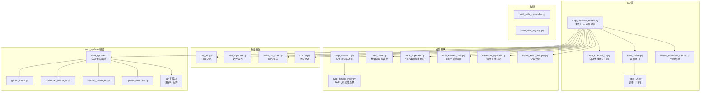

# CLAUDE.md

> 最后更新：2026-03-31 | 请用中文回复，所有测试模块都放在 `test/` 中

## 项目概述

**Sap_Operation_HDL** — 基于 Python + PyQt5 的 SAP 自动化工具，提供 SAP 订单自动创建、数据处理、PDF 发票重命名、营收工时分配等功能，具有多选项卡 GUI 界面。

## 架构总览



## 模块索引

| 模块 | 路径 | 职责 |
|------|------|------|
| 主入口 | `Sap_Operate_theme.py` | MyMainWindow 主窗口，集成所有功能 |
| SAP 自动化 | `Sap_Function.py` | Sap 类，通过 win32com 操作 SAP GUI |
| SAP 智能查找 | `Sap_SmartFinder.py` | SmartContainerFinder，SAP 元素定位 |
| 数据读取 | `Get_Data.py` | Get_Data 类，Excel/CSV 读取与字段映射 |
| 字段映射 | `Excel_Field_Mapper.py` | ExcelFieldMapper，多命名风格字段匹配 |
| PDF 操作 | `PDF_Operate.py` | PDF_Operate 类，PDF 读取与另存 |
| PDF 解析 | `PDF_Parser_Utils.py` | 发票字段提取（公司名、金额、发票号） |
| 营收分配 | `Revenue_Operate.py` | RevenueAllocator，工时与营收分配计算 |
| 表格窗口 | `Data_Table.py` | MyTableWindow，数据表格展示 |
| 日志 | `Logger.py` | Logger 类，基于 pandas 的操作日志 |
| 文件操作 | `File_Operate.py` | File_Opetate 类，路径和文件夹管理 |
| CSV 保存 | `Save_To_CSV.py` | CSV 文件保存工具 |
| 主题管理 | `theme_manager_theme.py` | ThemeManager，应用主题切换 |
| 图标资源 | `chicon.py` | 内嵌图标 base64 数据 |
| 自动更新 | `auto_updater/` | 基于 GitHub Releases 的完整更新系统 |
| 构建脚本 | `build_with_pyinstaller.py` | PyInstaller 打包 |
| 签名构建 | `build_with_signing.py` | 带代码签名的打包 |

## 关键依赖

- **PyQt5** 5.15.11 — GUI 框架
- **pandas** 2.2.2 — 数据处理
- **win32com** — SAP GUI Scripting 自动化（仅 Windows）
- **pdfplumber / pdfminer.six / pypdfium2** — PDF 解析
- **openpyxl** — Excel 读写
- **chinese_calendar** — 中国节假日判断（营收模块）
- **PyInstaller** — 构建可执行文件

## 常用命令

```bash
# 运行主程序
python Sap_Operate_theme.py

# 构建可执行文件
python build_with_pyinstaller.py

# 手动 PyInstaller
pyinstaller --onefile --windowed --clean --noconfirm --icon=Sap_Operate_Logo.ico Sap_Operate_theme.py
```

## 数据流

1. **输入** → Excel/CSV 文件经 `Get_Data.py` 读取
2. **映射** → `Excel_Field_Mapper.py` 统一多命名风格字段
3. **SAP 操作** → `Sap_Function.py` 通过 win32com 自动化 SAP GUI
4. **PDF 处理** → `PDF_Operate.py` + `PDF_Parser_Utils.py` 解析发票并重命名
5. **营收分配** → `Revenue_Operate.py` 按工时分配营收
6. **输出** → GUI 展示 + 日志记录

## SAP 集成要求

- SAP GUI 已安装并运行
- Scripting 已在 SAP GUI 中启用
- 用户具有相应 SAP 权限

## 配置

- 桌面 `config/config_sap.csv` — 用户配置文件
- `auto_updater/config_constants.py` — 版本号与更新配置

## 文件命名约定

- `*_Ui.py` — Qt Designer 生成的 UI 代码（勿手动编辑）
- `*.ui` — Qt Designer 源文件
- `*.ico` — 应用图标
- `dist/` / `build/` — 构建产物（已 gitignore）

## 全局规范

- 所有回复使用中文
- 测试文件放在 `test/` 目录
- UI 文件由 Qt Designer 生成，不手动编辑 `*_Ui.py`
- 字段映射通过 `Excel_Field_Mapper.py` 的映射表维护
