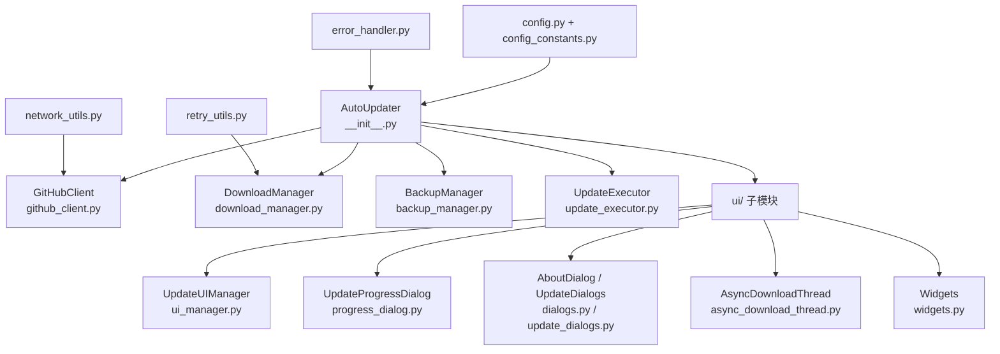

# auto_updater 模块

> [← 返回根目录](../CLAUDE.md) > auto_updater

## 模块职责

基于 GitHub Releases 的完整自动更新系统，支持版本检查、文件下载、备份回滚和 UI 交互。

## 架构



## 关键文件

| 文件 | 类/函数 | 职责 |
|------|---------|------|
| `__init__.py` | `AutoUpdater` | 主接口类，整合所有更新组件 |
| `github_client.py` | `GitHubClient` | GitHub API 交互，获取版本和下载链接 |
| `download_manager.py` | `DownloadManager` | 文件下载与进度回调 |
| `backup_manager.py` | `BackupManager` | 更新前备份与回滚 |
| `update_executor.py` | `UpdateExecutor` | 执行实际的文件替换更新 |
| `config.py` | `get_config()` | 更新配置管理 |
| `config_constants.py` | `CURRENT_VERSION` | 当前版本号常量 |
| `network_utils.py` | — | 网络工具函数 |
| `retry_utils.py` | — | 重试机制 |
| `error_handler.py` | — | 错误处理 |
| `settings.py` | — | 更新设置 |
| `two_phase_updater.py` | — | 两阶段更新策略 |
| `auto_complete.py` | — | 更新完成处理 |

## UI 子模块 (`ui/`)

| 文件 | 职责 |
|------|------|
| `ui_manager.py` / `update_ui_manager.py` | 更新 UI 管理 |
| `progress_dialog.py` | 下载进度对话框 |
| `dialogs.py` / `update_dialogs.py` | 更新确认/关于对话框 |
| `async_download_thread.py` | 异步下载线程 |
| `widgets.py` | 状态小部件 |
| `resources.py` | UI 文本、样式、配置常量 |
| `examples.py` | 使用示例 |

## 公共接口

```python
from auto_updater import AutoUpdater, UI_AVAILABLE

updater = AutoUpdater(parent=main_window)
has_update, remote_ver, local_ver, err = updater.check_for_updates()
success, file_path, err = updater.download_update(version)
success, err = updater.execute_update(file_path, version)
success, err = updater.rollback_update()
updater.setup_update_ui(menu_bar)
```

## 异常体系

- `UpdateError` — 基础异常
  - `NetworkError` — 网络异常
  - `VersionCheckError` — 版本检查异常
  - `DownloadError` — 下载异常
  - `BackupError` — 备份异常
  - `UpdateExecutionError` — 执行异常

## 依赖

- `packaging` — 版本号解析
- `requests` — HTTP 请求
- `PyQt5` — UI 组件（可选，UI_AVAILABLE 标志）

## 集成示例

`集成示例/` 目录包含：
- `minimal_example.py` — 最小集成
- `standard_example.py` — 标准集成
- `advanced_example.py` — 高级集成
