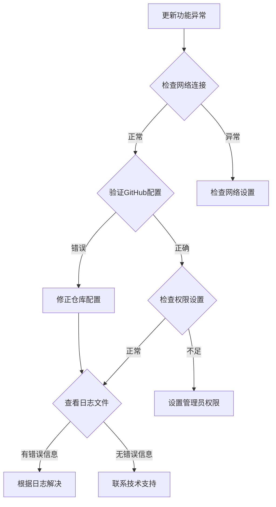

# AutoUpdater模块集成教程

## 📋 目录

1. [模块概述](#模块概述)
2. [✅ 集成检查清单](#-集成检查清单)
3. [快速入门](#快速入门)
4. [🔧 集成方案对比](#-集成方案对比)
   - [方案1：极简集成（推荐）](#方案1极简集成推荐)
   - [方案2：标准集成](#方案2标准集成)
   - [方案3：深度定制集成](#方案3深度定制集成)
5. [配置说明](#配置说明)
6. [部署准备](#部署准备)
7. [高级自定义](#高级自定义)
8. [🔍 故障排除](#-故障排除)
9. [最佳实践](#最佳实践)
10. [📋 快速参考](#-快速参考)

---

## 📖 模块概述

### 功能特性

**AutoUpdater** 是一个企业级的PyQt5自动更新模块，具备以下核心功能：

- ✅ **版本检查**: 基于GitHub API的智能版本比较
- ✅ **自动下载**: 多线程下载，支持进度显示和断点续传
- ✅ **安全备份**: 自动备份当前版本，支持一键回滚
- ✅ **原子更新**: 确保更新过程的安全性，失败自动恢复
- ✅ **UI集成**: 完整的用户界面，包括进度条、对话框等
- ✅ **错误处理**: 完善的异常处理和用户反馈
- ✅ **日志记录**: 详细的操作日志，便于问题排查

### 技术特点

- 🔒 **零配置文件**: 使用Python常量配置，提高安全性
- 🎨 **高度可定制**: 支持文本、样式、行为的全面自定义
- 🔄 **完全解耦**: UI与业务逻辑分离，可独立使用
- 🛡️ **企业级可靠性**: 完善的错误处理和回滚机制

### 系统要求

- Python 3.7+
- PyQt5 >= 5.15.0
- requests >= 2.25.0
- packaging >= 21.0
- GitHub仓库（用于版本发布）

---

## 🚀 快速入门

### 第一步：复制模块

将整个 `auto_updater` 文件夹复制到您的项目根目录：

```bash
# 从原项目复制
cp -r /path/to/Temu_PDF_Rename_APP/auto_updater/ /path/to/your/project/

# 或者下载模块文件
# （确保包含所有子文件和文件夹）
```

### 第二步：安装依赖

确保项目中已安装必需的依赖：

```bash
pip install PyQt5 requests packaging
```

### 第三步：极简集成（推荐）

在您的主窗口类中添加以下代码：

```python
from PyQt5.QtWidgets import QMainWindow, QApplication
from auto_updater import AutoUpdater

class MainWindow(QMainWindow):
    def __init__(self):
        super().__init__()
        self.setup_ui()

        # 自动更新集成 - 仅需3行代码
        self.auto_updater = AutoUpdater(self)
        self.auto_updater.setup_update_ui(self.menuBar(), "帮助(H)")

    def setup_ui(self):
        """您的UI设置代码"""
        self.setWindowTitle("您的应用程序")
        # ... 其他UI设置 ...

    def closeEvent(self, event):
        """应用退出时清理资源"""
        if hasattr(self, 'auto_updater'):
            self.auto_updater.cleanup()
        event.accept()

if __name__ == "__main__":
    app = QApplication([])
    window = MainWindow()
    window.show()
    app.exec_()
```

### 第四步：配置基本信息

编辑 `auto_updater/config_constants.py`，修改以下配置：

```python
# 应用程序配置
APP_NAME = "您的应用程序名称"
APP_EXECUTABLE = "your_app.exe"
CURRENT_VERSION = "1.0.0"

# GitHub配置
GITHUB_OWNER = "your-username"      # 您的GitHub用户名
GITHUB_REPO = "your-repo-name"      # 您的仓库名称
```

### 第五步：测试功能

1. **运行应用程序**：菜单栏中会出现"帮助(H)"菜单，包含"检查更新"和"关于"选项
2. **版本检查**：点击"检查更新"测试版本检查功能
3. **发布版本**：在GitHub上创建Release测试完整更新流程

**恭喜！** 🎉 您已经成功集成了自动更新功能！

---

## ✅ 集成检查清单

### 基础配置
- [ ] **复制模块**: 将auto_updater文件夹复制到项目根目录
- [ ] **安装依赖**: 确保已安装PyQt5、requests、packaging
- [ ] **修改应用配置**: 在config_constants.py中设置APP_NAME
- [ ] **设置GitHub信息**: 配置GITHUB_OWNER和GITHUB_REPO
- [ ] **配置版本号**: 设置正确的CURRENT_VERSION

### 集成测试
- [ ] **运行示例**: 执行minimal_example.py验证基础功能
- [ ] **检查菜单**: 验证菜单栏中的更新选项是否显示
- [ ] **测试版本检查**: 点击"检查更新"测试网络连接
- [ ] **验证错误处理**: 断开网络测试错误提示
- [ ] **查看日志输出**: 检查控制台日志是否正常

### 生产部署
- [ ] **创建GitHub Release**: 在仓库中创建发布版本
- [ ] **上传exe文件**: 上传打包好的应用程序
- [ ] **测试完整流程**: 从检查到安装的完整流程
- [ ] **验证备份功能**: 确保备份和回滚正常工作
- [ ] **配置生产日志**: 设置详细的日志记录

---

## 🔧 集成方案对比

| 特性 | 极简集成 | 标准集成 | 深度定制 |
|------|---------|---------|----------|
| **代码行数** | 3行 | 15行 | 80+行 |
| **错误处理** | 基础 | 完善 | 自定义 |
| **UI控制** | 自动 | 部分 | 完全 |
| **配置能力** | 默认 | 基本配置 | 完全定制 |
| **适用场景** | 快速验证、小型项目 | 生产环境、标准应用 | 企业应用、特殊需求 |
| **集成时间** | 5分钟 | 15分钟 | 1小时+ |
| **维护成本** | 低 | 中 | 高 |

**推荐选择**：
- 🚀 **快速演示** → 极简集成
- 🏭 **生产环境** → 标准集成
- 🎯 **特殊需求** → 深度定制

### 方案1：极简集成（推荐）

**适用场景**：快速集成，保持默认行为

**特点**：
- 只需3行核心代码
- 自动处理所有UI和逻辑
- 使用默认配置和行为

**代码示例**：

```python
from auto_updater import AutoUpdater

class MainWindow(QMainWindow):
    def __init__(self):
        super().__init__()
        self.setup_ui()

        # 极简集成 - 仅此而已！
        self.auto_updater = AutoUpdater(self)
        self.auto_updater.setup_update_ui(self.menuBar(), "帮助(H)")

    def closeEvent(self, event):
        if hasattr(self, 'auto_updater'):
            self.auto_updater.cleanup()
        event.accept()
```

**效果**：
- ✅ 菜单栏自动添加更新相关选项
- ✅ 启动时自动检查更新
- ✅ 完整的更新UI和进度显示
- ✅ 自动备份和回滚功能
- ✅ 完善的错误处理

---

### 方案2：标准集成

**适用场景**：需要基本自定义和错误处理

**特点**：
- 完善的错误处理和日志记录
- 支持基本配置和状态管理
- 保持代码整洁和可维护性

**代码示例**：

```python
from auto_updater import AutoUpdater, UI_AVAILABLE
import logging

logger = logging.getLogger(__name__)

class MainWindow(QMainWindow):
    def __init__(self):
        super().__init__()
        self.setup_ui()
        self.setup_auto_update()

    def setup_auto_update(self):
        """标准集成方案"""
        try:
            if UI_AVAILABLE:
                # 初始化更新器
                self.auto_updater = AutoUpdater(self)

                # 设置更新UI
                success = self.auto_updater.setup_update_ui(
                    self.menuBar(), "帮助(H)"
                )

                if success:
                    logger.info("自动更新功能集成成功")

                    # 可选：自定义配置
                    self.auto_updater.enable_auto_check = True
                    self.auto_updater.check_interval = 24 * 3600  # 24小时

                else:
                    logger.warning("自动更新功能集成失败")
                    self.auto_updater = None

            else:
                logger.warning("UI模块不可用，跳过自动更新功能")
                self.auto_updater = None

        except Exception as e:
            logger.error(f"自动更新器初始化失败: {e}")
            self.auto_updater = None

    def setup_ui(self):
        """您的UI设置代码"""
        self.setWindowTitle("您的应用程序")
        # ... 其他UI设置 ...

    def closeEvent(self, event):
        """应用退出清理"""
        if hasattr(self, 'auto_updater') and self.auto_updater:
            self.auto_updater.cleanup()
            logger.info("自动更新器资源已清理")
        event.accept()
```

**新增功能**：
- ✅ 详细的日志记录
- ✅ 完善的错误处理
- ✅ 可配置的更新检查间隔
- ✅ 模块化的代码结构

---

### 方案3：深度定制集成

**适用场景**：需要完全控制更新流程和UI

**特点**：
- 完全控制更新检查和UI显示
- 自定义对话框和交互逻辑
- 支持特殊的业务需求

**代码示例**：

```python
from auto_updater import AutoUpdater, UpdateUIManager
from auto_updater.ui.dialogs import UpdateProgressDialog
from PyQt5.QtWidgets import QMessageBox
import logging

logger = logging.getLogger(__name__)

class MainWindow(QMainWindow):
    def __init__(self):
        super().__init__()
        self.setup_ui()
        self.setup_custom_auto_update()

    def setup_custom_auto_update(self):
        """深度定制集成方案"""
        try:
            # 初始化更新器
            self.auto_updater = AutoUpdater(self)

            # 创建独立的UI管理器
            self.update_ui_manager = UpdateUIManager(
                self.auto_updater, self
            )

            # 手动设置菜单项
            self.setup_custom_menu()

            # 自定义配置
            self.configure_update_settings()

            logger.info("自定义自动更新功能初始化完成")

        except Exception as e:
            logger.error(f"自定义自动更新器初始化失败: {e}")
            self.auto_updater = None
            self.update_ui_manager = None

    def setup_custom_menu(self):
        """设置自定义更新菜单"""
        help_menu = self.menuBar().addMenu("帮助(H)")

        # 检查更新
        check_action = help_menu.addAction("检查更新")
        check_action.triggered.connect(self.custom_check_updates)

        help_menu.addSeparator()

        # 关于对话框
        about_action = help_menu.addAction("关于")
        about_action.triggered.connect(self.show_custom_about)

    def custom_check_updates(self):
        """自定义更新检查流程"""
        if not self.auto_updater:
            self.show_error("自动更新功能不可用")
            return

        # 显示检查状态
        self.show_info("正在检查更新...")

        # 手动检查更新
        has_update, remote_version, local_version, error = \
            self.auto_updater.check_for_updates(force_check=True)

        if error:
            self.show_error(f"检查更新失败: {error}")
            return

        if has_update:
            # 自定义更新确认对话框
            reply = QMessageBox.question(
                self, "发现新版本",
                f"当前版本: {local_version}\n"
                f"最新版本: {remote_version}\n\n"
                "是否立即下载更新？",
                QMessageBox.Yes | QMessageBox.No,
                QMessageBox.Yes
            )

            if reply == QMessageBox.Yes:
                self.show_custom_update_dialog(remote_version, local_version)
        else:
            self.show_info("已是最新版本")

    def show_custom_update_dialog(self, remote_version, local_version):
        """显示自定义更新对话框"""
        # 创建自定义进度对话框
        dialog = UpdateProgressDialog(self, remote_version, local_version)

        # 连接下载完成回调
        dialog.download_finished.connect(
            lambda success, msg: self.on_download_finished(success, msg, dialog)
        )

        # 开始更新流程
        dialog.start_update(remote_version, self.auto_updater)

    def on_download_finished(self, success, message, dialog):
        """下载完成回调"""
        dialog.close()

        if success:
            reply = QMessageBox.question(
                self, "更新下载完成",
                "更新已下载完成，是否立即安装？\n"
                "安装后将自动重启应用程序。",
                QMessageBox.Yes | QMessageBox.No,
                QMessageBox.Yes
            )

            if reply == QMessageBox.Yes:
                # 这里可以添加自定义的安装逻辑
                self.show_info("准备安装更新...")
        else:
            self.show_error(f"更新下载失败: {message}")

    def show_custom_about(self):
        """自定义关于对话框"""
        QMessageBox.about(
            self, "关于",
            "您的应用程序\n\n"
            f"版本: {self.auto_updater.current_version if self.auto_updater else '未知'}\n"
            "自动更新功能已集成\n"
            "© 2025 您的公司"
        )

    def configure_update_settings(self):
        """配置更新设置"""
        if self.auto_updater:
            # 自定义设置
            self.auto_updater.enable_auto_check = True
            self.auto_updater.check_interval = 24 * 3600  # 24小时

            # 更多自定义配置...

    def show_info(self, message):
        """显示信息对话框"""
        QMessageBox.information(self, "信息", message)

    def show_error(self, message):
        """显示错误对话框"""
        QMessageBox.critical(self, "错误", message)

    def closeEvent(self, event):
        """自定义清理流程"""
        if hasattr(self, 'auto_updater') and self.auto_updater:
            if hasattr(self, 'update_ui_manager'):
                self.update_ui_manager.cleanup()
            self.auto_updater.cleanup()
            logger.info("自定义自动更新器资源已清理")
        event.accept()
```

**自定义功能**：
- ✅ 完全控制所有UI和交互
- ✅ 自定义更新检查流程
- ✅ 自定义对话框和消息
- ✅ 自定义安装逻辑
- ✅ 完整的事件回调处理

---

## ⚙️ 配置说明

### 基础配置

编辑 `auto_updater/config_constants.py`：

```python
# 应用程序基本信息
APP_NAME = "您的应用程序名称"           # 在UI中显示的应用名
APP_EXECUTABLE = "your_app.exe"       # 打包后的可执行文件名
CURRENT_VERSION = "1.0.0"             # 当前版本号

# GitHub仓库配置
GITHUB_OWNER = "your-username"        # GitHub用户名或组织名
GITHUB_REPO = "your-repo-name"        # GitHub仓库名称
```

### 网络配置

```python
class NetworkConfig:
    # 超时设置（秒）
    TIMEOUTS = {
        'check': 15,        # 版本检查超时
        'download': 600,    # 下载超时
        'connection': 10    # 连接超时
    }

    # 重试设置
    RETRY = {
        'max_retries': 3,   # 最大重试次数
        'base_delay': 2     # 基础延迟时间（秒）
    }

    # 请求头
    HEADERS = {
        "Accept": "application/vnd.github.v3+json",
        "User-Agent": f"{APP_NAME}-AutoUpdater/{CURRENT_VERSION}"
    }
```

### 更新行为配置

```python
# 更新设置
AUTO_CHECK_ENABLED = True              # 启用启动时自动检查
CHECK_INTERVAL_HOURS = 24              # 检查间隔（小时）
BACKUP_ENABLED = True                  # 启用自动备份
MAX_BACKUP_COUNT = 5                   # 最大备份数量
```

### UI配置

```python
# 界面配置
DEFAULT_LOCALE = "zh_CN"              # 默认语言
WINDOW_ICON = None                    # 窗口图标路径
MAIN_MENU_TEXT = "帮助(H)"             # 主菜单文本
```

### 自定义文本

如果需要修改界面文本，可以编辑 `auto_updater/ui/resources.py` 中的 `TextResources` 类：

```python
class TextResources:
    """文本资源类"""

    # 更新相关文本
    UPDATE_AVAILABLE = "发现新版本"
    CURRENT_VERSION = "当前版本"
    LATEST_VERSION = "最新版本"

    # 按钮文本
    DOWNLOAD_UPDATE = "下载更新"
    INSTALL_UPDATE = "安装更新"
    LATER = "稍后"

    # 状态文本
    CHECKING_UPDATES = "正在检查更新..."
    DOWNLOADING_UPDATE = "正在下载更新..."
    INSTALLING_UPDATE = "正在安装更新..."
```

---

## 🚀 部署准备

### GitHub Release设置

1. **创建GitHub仓库**（如果还没有）
2. **配置Release流程**：

```bash
# 1. 标记新版本
git tag -a v1.0.0 -m "Release version 1.0.0"
git push origin v1.0.0

# 2. 在GitHub上创建Release
# - 访问 https://github.com/your-username/your-repo/releases
# - 点击 "Create a new release"
# - 选择标签版本
# - 添加发布说明
# - 上传打包好的exe文件
```

3. **发布资产命名**：
   - 确保exe文件名与 `APP_EXECUTABLE` 配置一致
   - 建议包含版本号：`YourApp_v1.0.0.exe`

### 应用程序打包

使用PyInstaller打包您的应用程序：

```bash
# 安装PyInstaller
pip install pyinstaller

# 打包为单文件
pyinstaller --onefile --windowed --icon=app.ico your_main.py

# 生成的exe文件在 dist/ 目录下
```

### 打包脚本示例

创建 `build.py`：

```python
import PyInstaller.__main__
import os
import shutil

def build_app():
    """构建应用程序"""
    # PyInstaller参数
    args = [
        'your_main.py',
        '--onefile',           # 单文件模式
        '--windowed',          # 无控制台窗口
        '--icon=app.ico',      # 应用图标
        '--name=YourApp',      # 应用名称
        '--add-data=auto_updater;auto_updater',  # 包含auto_updater模块
        '--distpath=dist',     # 输出目录
        '--workpath=build',    # 工作目录
        '--specpath=.'         # spec文件位置
    ]

    # 执行打包
    PyInstaller.__main__.run(args)

    # 重命名exe文件（如果需要）
    old_name = os.path.join('dist', 'YourApp.exe')
    new_name = os.path.join('dist', 'your_app.exe')

    if os.path.exists(old_name):
        shutil.move(old_name, new_name)
        print(f"打包完成: {new_name}")
    else:
        print("打包失败，未找到输出文件")

if __name__ == "__main__":
    build_app()
```

### 测试更新流程

1. **版本测试**：
   ```python
   # 在config_constants.py中设置较低的版本号
   CURRENT_VERSION = "0.9.0"
   ```

2. **本地测试**：
   - 运行应用程序
   - 检查更新功能是否正常工作
   - 验证下载和安装流程

3. **发布测试**：
   - 创建测试Release
   - 上传测试版本的exe文件
   - 验证完整更新流程

---

## 🎨 高级自定义

### 自定义UI组件

如果需要完全自定义UI界面，可以继承和扩展现有的组件：

```python
from auto_updater.ui.dialogs import UpdateProgressDialog
from PyQt5.QtWidgets import QVBoxLayout, QLabel, QProgressBar

class CustomUpdateDialog(UpdateProgressDialog):
    """自定义更新对话框"""

    def __init__(self, parent, remote_version, local_version):
        super().__init__(parent, remote_version, local_version)
        self.setup_custom_ui()

    def setup_custom_ui(self):
        """设置自定义UI"""
        # 添加自定义组件
        layout = QVBoxLayout()

        # 自定义标题
        title_label = QLabel("🚀 发现新版本")
        title_label.setStyleSheet("font-size: 16px; font-weight: bold;")
        layout.addWidget(title_label)

        # 版本信息
        version_info = QLabel(f"当前版本: {self.local_version}\n"
                             f"最新版本: {self.remote_version}")
        layout.addWidget(version_info)

        # 进度条
        self.progress_bar = QProgressBar()
        layout.addWidget(self.progress_bar)

        self.setLayout(layout)
```

### 自定义更新逻辑

```python
from auto_updater import AutoUpdater

class CustomAutoUpdater(AutoUpdater):
    """自定义更新器"""

    def __init__(self, parent):
        super().__init__(parent)
        self.custom_settings = {}

    def custom_version_check(self):
        """自定义版本检查逻辑"""
        # 在这里可以实现自定义的版本检查逻辑
        # 例如：检查私有服务器、使用不同的API等
        pass

    def custom_download_logic(self, version, callback=None):
        """自定义下载逻辑"""
        # 实现特殊的下载逻辑
        # 例如：从多个镜像下载、断点续传等
        pass
```

### 插件化扩展

```python
class UpdatePlugin:
    """更新插件基类"""

    def __init__(self, updater):
        self.updater = updater

    def before_check(self):
        """版本检查前调用"""
        pass

    def after_check(self, has_update, version_info):
        """版本检查后调用"""
        pass

    def before_download(self, version):
        """下载前调用"""
        pass

    def after_download(self, success, file_path):
        """下载后调用"""
        pass

class LoggingPlugin(UpdatePlugin):
    """日志插件"""

    def before_check(self):
        print("开始版本检查...")

    def after_check(self, has_update, version_info):
        if has_update:
            print(f"发现新版本: {version_info}")
        else:
            print("已是最新版本")

# 使用插件
updater = AutoUpdater(parent)
logging_plugin = LoggingPlugin(updater)
updater.add_plugin(logging_plugin)
```

---

## 🔍 故障排除

### 故障诊断向导

#### 🚨 更新功能不工作



#### 常见问题快速解决

1. **模块导入失败**
   ```bash
   # 检查模块路径
   ls auto_updater/
   ls auto_updater/__init__.py
   ```

2. **网络连接问题**
   ```python
   # 测试GitHub连接
   import requests
   requests.get('https://api.github.com', timeout=10)
   ```

3. **权限不足**
   ```bash
   # 以管理员身份运行应用
   # 或修改安装目录权限
   ```

### 错误代码对照表

| 错误信息 | 原因 | 解决方案 |
|---------|------|---------|
| `ModuleNotFoundError` | 模块路径错误 | 检查auto_updater位置 |
| `ConnectionError` | 网络连接失败 | 检查网络或使用代理 |
| `PermissionError` | 文件权限不足 | 以管理员身份运行 |
| `HTTP 403` | API限制 | 配置GitHub Token |
| `TimeoutError` | 下载超时 | 增加超时时间 |

---

## 最佳实践

### 代码组织

1. **模块化设计**：
```python
# 将更新相关代码封装在单独的方法中
class MainWindow(QMainWindow):
    def __init__(self):
        super().__init__()
        self.setup_ui()
        self.setup_auto_update()

    def setup_auto_update(self):
        """专门处理自动更新设置的方法"""
        pass

    def setup_ui(self):
        """专门处理UI设置的方法"""
        pass
```

2. **配置分离**：
```python
# 创建专门的配置类
class UpdateConfig:
    APP_NAME = "您的应用程序"
    GITHUB_OWNER = "your-username"
    GITHUB_REPO = "your-repo-name"
    CURRENT_VERSION = "1.0.0"

    # 从外部读取版本号（可选）
    @classmethod
    def load_version_from_file(cls):
        try:
            with open('version.txt', 'r') as f:
                cls.CURRENT_VERSION = f.read().strip()
        except FileNotFoundError:
            pass
```

### 错误处理

1. **渐进式降级**：

#### 2. GitHub API限制

**问题**: 版本检查失败，提示API限制

**解决方案**:
```python
# 在config_constants.py中添加GitHub Token（可选）
GITHUB_TOKEN = None  # 或 "your_github_token"

# 或者添加请求头
HEADERS = {
    "Accept": "application/vnd.github.v3+json",
    "User-Agent": f"{APP_NAME}-AutoUpdater/{CURRENT_VERSION}"
}
```

#### 3. 网络连接问题

**问题**: 无法连接到GitHub

**解决方案**:
```python
# 检查网络连接
import requests
try:
    response = requests.get('https://api.github.com', timeout=10)
    print(f"GitHub连接状态: {response.status_code}")
except Exception as e:
    print(f"网络连接失败: {e}")

# 调整超时设置
class NetworkConfig:
    TIMEOUTS = {
        'check': 30,        # 增加版本检查超时
        'download': 1200,   # 增加下载超时
        'connection': 20    # 增加连接超时
    }
```

#### 4. 下载失败

**问题**: 更新下载中断或失败

**解决方案**:
```python
# 启用详细日志
import logging
logging.basicConfig(level=logging.DEBUG)

# 检查磁盘空间
import shutil
total, used, free = shutil.disk_usage('/')
print(f"可用磁盘空间: {free // (1024**3)}GB")

# 调整重试设置
class NetworkConfig:
    RETRY = {
        'max_retries': 5,   # 增加重试次数
        'base_delay': 5     # 增加基础延迟
    }
```

#### 5. 权限问题

**问题**: 无法创建备份或替换文件

**解决方案**:
```python
# 检查文件权限
import os
import stat

def check_file_permissions(file_path):
    """检查文件权限"""
    if os.path.exists(file_path):
        file_stat = os.stat(file_path)
        permissions = stat.filemode(file_stat.st_mode)
        print(f"文件权限: {permissions}")
    else:
        print(f"文件不存在: {file_path}")

# 检查应用程序目录权限
check_file_permissions('.')
check_file_permissions('backup')
```

### 调试技巧

#### 1. 启用详细日志

```python
import logging

# 设置日志级别
logging.basicConfig(
    level=logging.DEBUG,
    format='%(asctime)s - %(name)s - %(levelname)s - %(message)s',
    handlers=[
        logging.FileHandler('updater_debug.log'),
        logging.StreamHandler()
    ]
)

# 设置特定模块的日志级别
logging.getLogger('auto_updater').setLevel(logging.DEBUG)
```

#### 2. 测试单个功能

```python
# 测试GitHub连接
from auto_updater.github_client import GitHubClient

client = GitHubClient()
releases = client.get_releases()
print(f"获取到 {len(releases)} 个发布版本")

# 测试版本比较
from packaging import version

local_version = "1.0.0"
remote_version = "1.1.0"

if version.parse(remote_version) > version.parse(local_version):
    print("需要更新")
else:
    print("已是最新版本")
```

#### 3. 手动触发更新

```python
# 在代码中添加手动触发按钮
def test_update(self):
    """测试更新功能"""
    if hasattr(self, 'auto_updater') and self.auto_updater:
        try:
            # 强制检查更新
            has_update, remote_version, local_version, error = \
                self.auto_updater.check_for_updates(force_check=True)

            print(f"更新检查结果: {has_update}")
            print(f"远程版本: {remote_version}")
            print(f"本地版本: {local_version}")
            print(f"错误信息: {error}")

        except Exception as e:
            print(f"更新检查异常: {e}")
    else:
        print("自动更新器未初始化")
```

---

## 📋 最佳实践

### 代码组织

1. **模块化设计**：
```python
# 将更新相关代码封装在单独的方法中
class MainWindow(QMainWindow):
    def __init__(self):
        super().__init__()
        self.setup_ui()
        self.setup_auto_update()

    def setup_auto_update(self):
        """专门处理自动更新设置的方法"""
        pass

    def setup_ui(self):
        """专门处理UI设置的方法"""
        pass
```

2. **配置分离**：
```python
# 创建专门的配置类
class UpdateConfig:
    APP_NAME = "您的应用程序"
    GITHUB_OWNER = "your-username"
    GITHUB_REPO = "your-repo-name"
    CURRENT_VERSION = "1.0.0"

    # 从外部读取版本号（可选）
    @classmethod
    def load_version_from_file(cls):
        try:
            with open('version.txt', 'r') as f:
                cls.CURRENT_VERSION = f.read().strip()
        except FileNotFoundError:
            pass
```

### 错误处理

1. **渐进式降级**：
```python
def setup_auto_update(self):
    """设置自动更新功能"""
    try:
        # 尝试初始化完整功能
        self.auto_updater = AutoUpdater(self)
        success = self.auto_updater.setup_update_ui(self.menuBar())

        if not success:
            # 降级到基本功能
            self.setup_basic_update_menu()

    except ImportError:
        # 模块不可用，完全禁用
        self.auto_updater = None
        self.setup_no_update_menu()

    except Exception as e:
        # 其他错误，记录但继续运行
        logging.error(f"自动更新功能初始化失败: {e}")
        self.auto_updater = None
```

2. **用户友好的错误提示**：
```python
def handle_update_error(self, error):
    """处理更新错误的用户提示"""
    error_messages = {
        'network': "网络连接失败，请检查网络设置",
        'permission': "权限不足，请以管理员身份运行",
        'disk_space': "磁盘空间不足，请清理后重试",
        'github_api': "无法连接到GitHub，请稍后重试"
    }

    message = error_messages.get(error.type, "更新失败，请稍后重试")
    QMessageBox.warning(self, "更新错误", message)
```

### 性能优化

1. **异步操作**：
```python
import threading
from PyQt5.QtCore import QThread, pyqtSignal

class UpdateCheckThread(QThread):
    update_found = pyqtSignal(str, str)
    no_update = pyqtSignal()
    error_occurred = pyqtSignal(str)

    def __init__(self, updater):
        super().__init__()
        self.updater = updater

    def run(self):
        """在后台线程中检查更新"""
        try:
            has_update, remote_version, local_version, error = \
                self.updater.check_for_updates()

            if error:
                self.error_occurred.emit(error)
            elif has_update:
                self.update_found.emit(remote_version, local_version)
            else:
                self.no_update.emit()

        except Exception as e:
            self.error_occurred.emit(str(e))

# 在主窗口中使用
def check_updates_async(self):
    """异步检查更新"""
    self.check_thread = UpdateCheckThread(self.auto_updater)
    self.check_thread.update_found.connect(self.on_update_found)
    self.check_thread.no_update.connect(self.on_no_update)
    self.check_thread.error_occurred.connect(self.on_update_error)
    self.check_thread.start()
```

2. **缓存机制**：
```python
class CachedGitHubClient(GitHubClient):
    """带缓存的GitHub客户端"""

    def __init__(self):
        super().__init__()
        self._cache = {}
        self._cache_timeout = 3600  # 1小时缓存
        self._last_check = {}

    def get_releases(self, use_cache=True):
        """获取发布版本（带缓存）"""
        cache_key = 'releases'
        current_time = time.time()

        # 检查缓存
        if (use_cache and
            cache_key in self._cache and
            cache_key in self._last_check and
            current_time - self._last_check[cache_key] < self._cache_timeout):

            return self._cache[cache_key]

        # 获取新数据
        releases = super().get_releases()

        # 更新缓存
        self._cache[cache_key] = releases
        self._last_check[cache_key] = current_time

        return releases
```

### 安全考虑

1. **文件完整性检查**：
```python
import hashlib

def verify_file_integrity(file_path, expected_hash):
    """验证文件完整性"""
    sha256_hash = hashlib.sha256()

    with open(file_path, "rb") as f:
        for chunk in iter(lambda: f.read(4096), b""):
            sha256_hash.update(chunk)

    return sha256_hash.hexdigest() == expected_hash

# 在下载完成后验证
if verify_file_integrity(downloaded_file, expected_sha256):
    print("文件完整性验证通过")
else:
    print("文件完整性验证失败")
```

2. **数字签名验证**：
```python
import subprocess

def verify_digital_signature(file_path):
    """验证数字签名"""
    try:
        result = subprocess.run([
            'signtool', 'verify', '/pa', file_path
        ], capture_output=True, text=True)

        return result.returncode == 0
    except FileNotFoundError:
        # signtool不可用
        return True  # 或者返回False，取决于安全要求
```

### 用户体验

1. **进度反馈**：
```python
def show_detailed_progress(self, progress, speed, eta):
    """显示详细的下载进度"""
    progress_text = f"下载进度: {progress}%\n"
    progress_text += f"下载速度: {speed:.2f} MB/s\n"
    progress_text += f"预计剩余时间: {eta}"

    self.progress_label.setText(progress_text)
    self.progress_bar.setValue(progress)
```

2. **取消支持**：
```python
class CancellableDownloadManager(DownloadManager):
    """支持取消的下载管理器"""

    def __init__(self):
        super().__init__()
        self._cancelled = False

    def cancel_download(self):
        """取消下载"""
        self._cancelled = True

    def download_file(self, url, local_path, callback=None):
        """下载文件（支持取消）"""
        self._cancelled = False

        # 在下载循环中检查取消状态
        while downloading and not self._cancelled:
            # 下载逻辑
            pass

        if self._cancelled:
            self.cleanup()
            return False, "下载已取消"
```

---

## 📞 技术支持

如果在使用过程中遇到问题，可以：

1. **查看日志文件**：检查 `updater_debug.log` 获取详细错误信息
2. **运行测试代码**：使用文中的调试技巧进行问题定位
3. **参考源代码**：查看 `auto_updater` 模块的源代码了解实现细节
4. **提交Issue**：在GitHub仓库中提交问题报告

---

## 🎉 结语

AutoUpdater模块为您提供了一个完整、可靠、易用的自动更新解决方案。通过本教程，您应该能够：

- ✅ 快速集成自动更新功能
- ✅ 根据需求选择合适的集成方案
- ✅ 自定义和扩展更新功能
- ✅ 解决常见的集成问题
- ✅ 遵循最佳实践优化用户体验

希望这个模块能够帮助您的应用程序保持最新状态，为用户提供更好的体验！

---

**版本**: 1.0
**最后更新**: 2025年11月27日
**维护者**: AutoUpdater开发团队